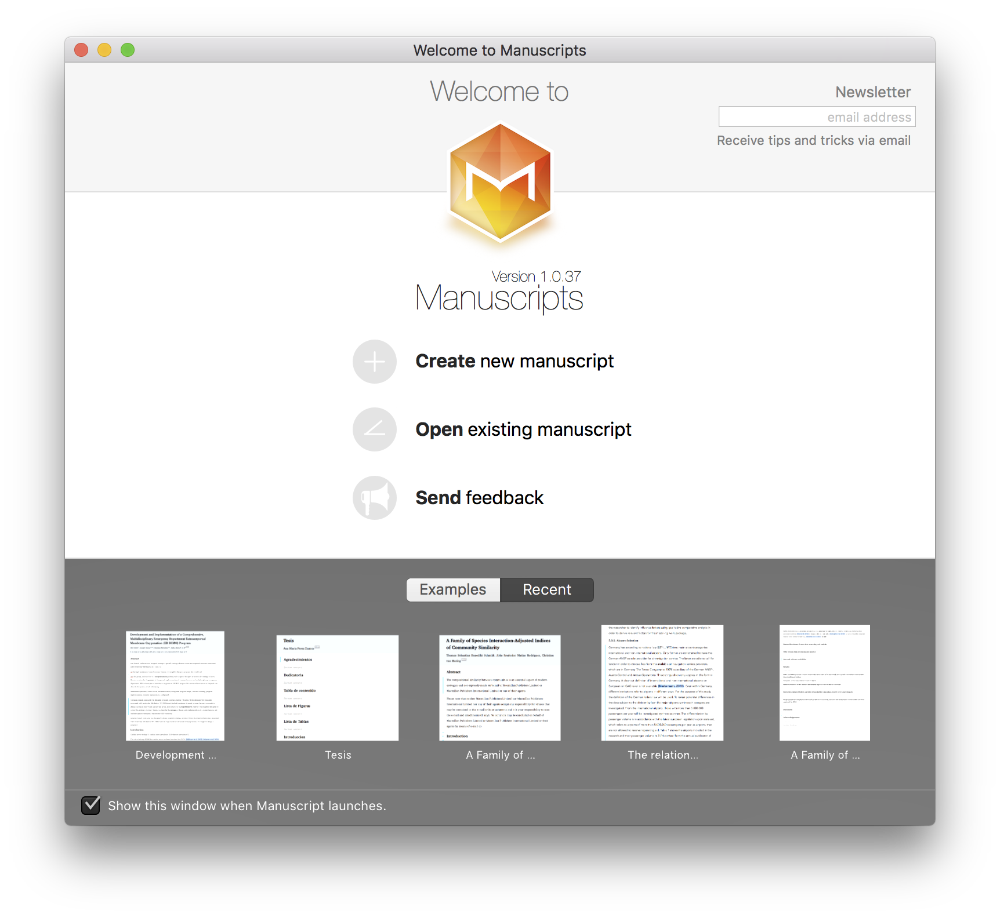

# MPSheetView

A one line tall collection view like control built in SceneKit. 

- Content is passed in using a sheet item data source protocol.
- Responds to left and right clicks.
- Keyboard navigable.
- Has certain amount of configurability in form of a series of [IBInspectable](http://nshipster.com/ibinspectable-ibdesignable/) properties.

As an example, in [Manuscripts](http://manuscriptsapp.com) for which the view was developed it looks like this (the MPSheetView is the thumbnail containing view at the bottom):



For a quick demo of of it, watch my NSConference 7 SceneKit intro talk (2015): https://vimeo.com/124317401

### Carthage

[Carthage](https://github.com/Carthage/Carthage) is a decentralized dependency manager that builds your dependencies and provides you with binary frameworks.

You can install Carthage with [Homebrew](http://brew.sh/) using the following command:

```bash
$ brew update
$ brew install carthage
```

To integrate MPSheetView into your Xcode project using Carthage, specify it in your `Cartfile`:

```ogdl
github "mpapp/MPSheetView" ~> 1.0
```

Run `carthage update` to build the framework and drag the built `MPSheetView.framework` into your Xcode project.

You'll want to also link SceneKit into the build target that uses MPSheetView.
